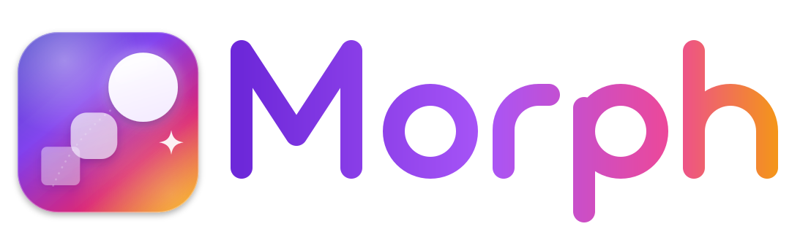
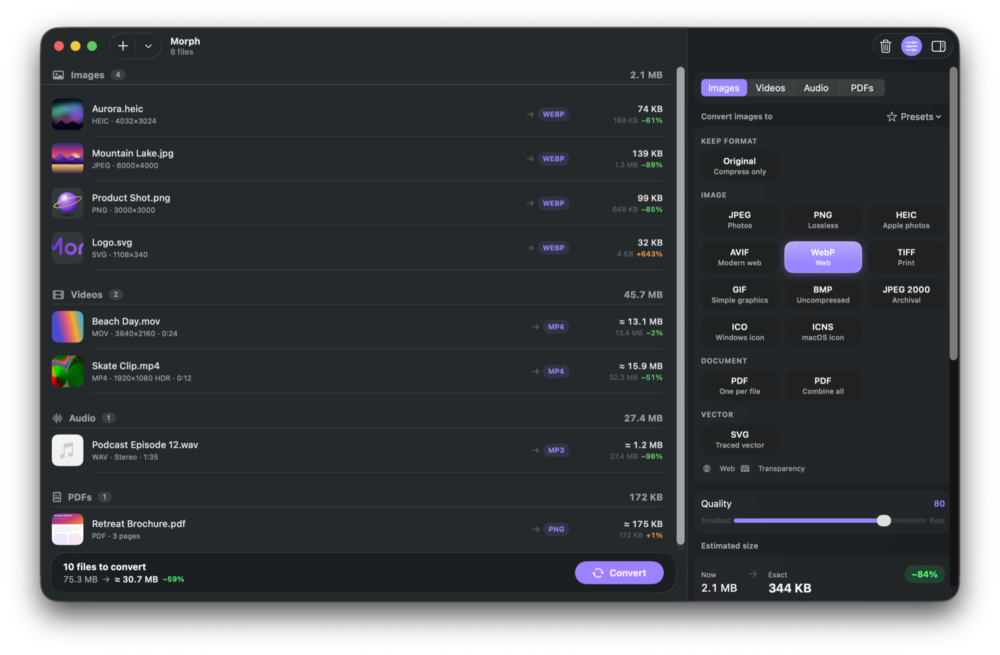
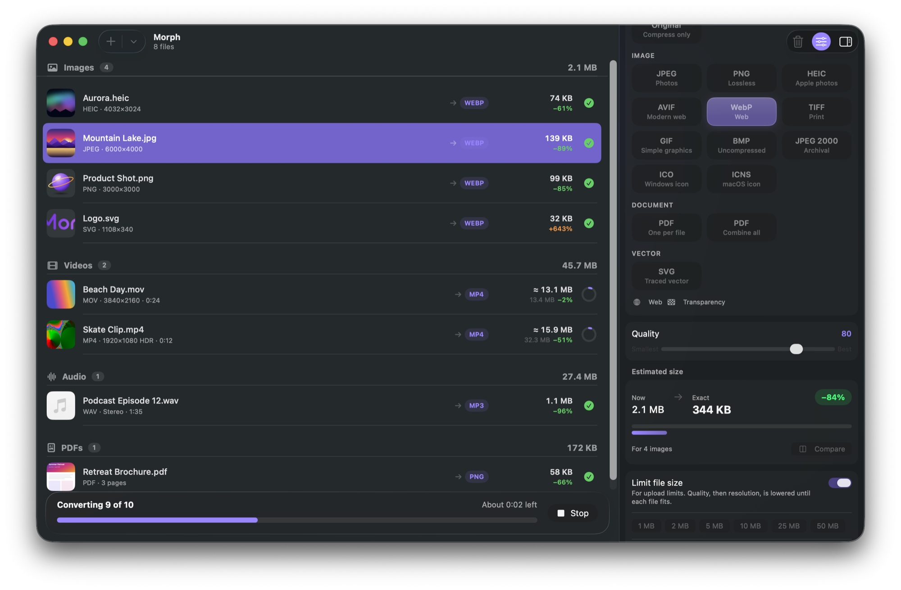
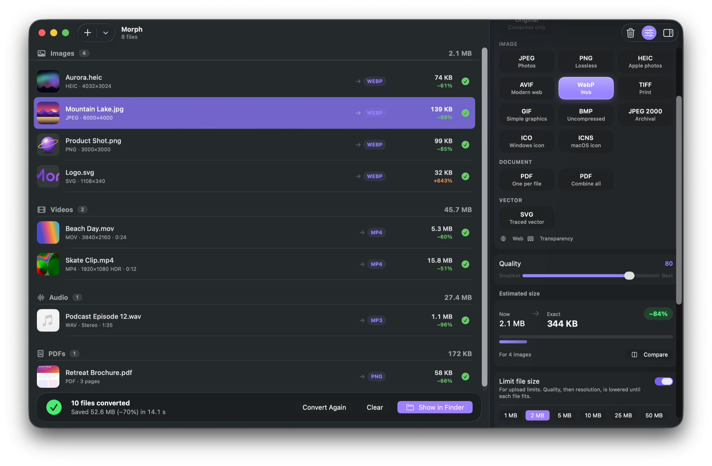
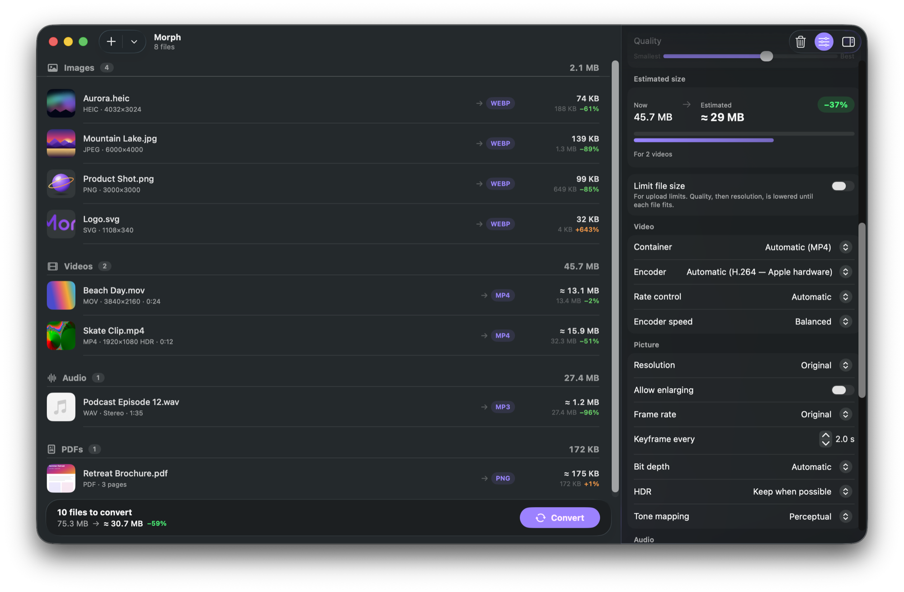
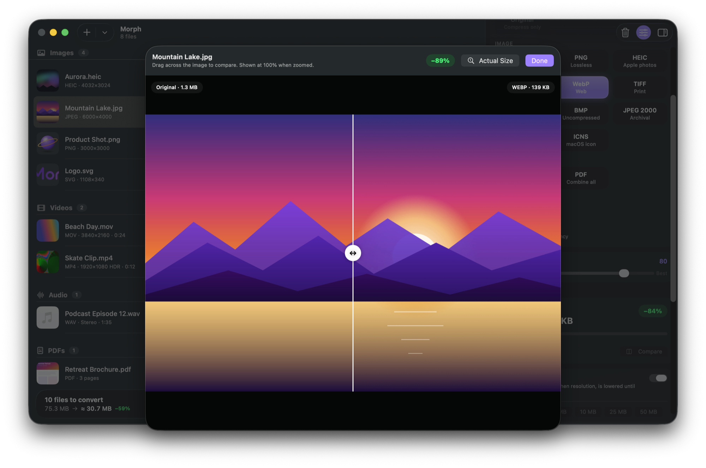
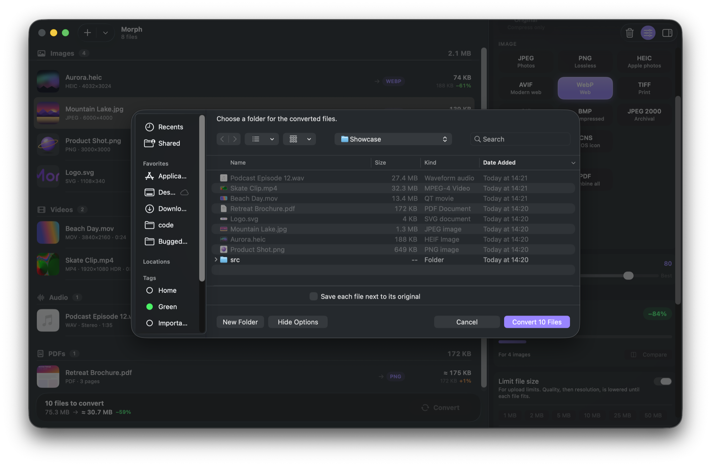
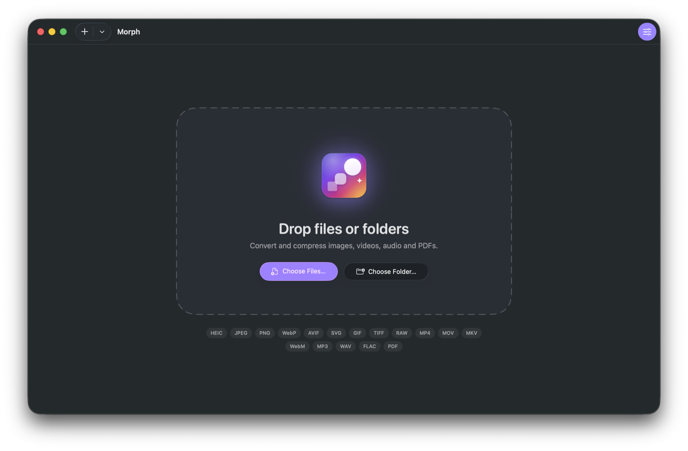
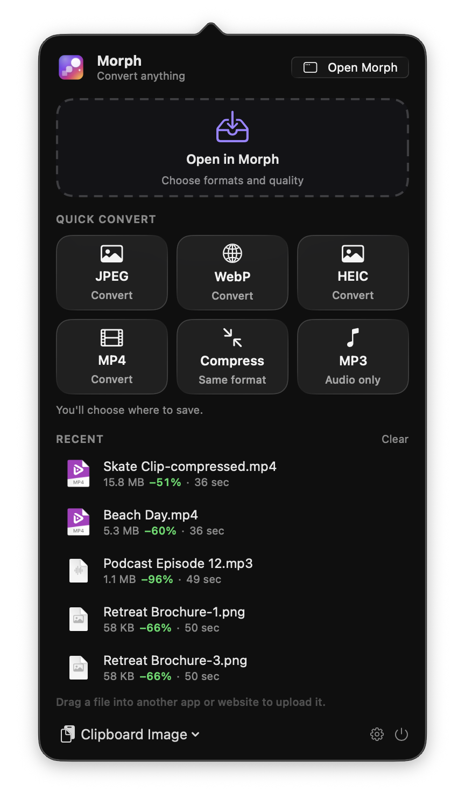
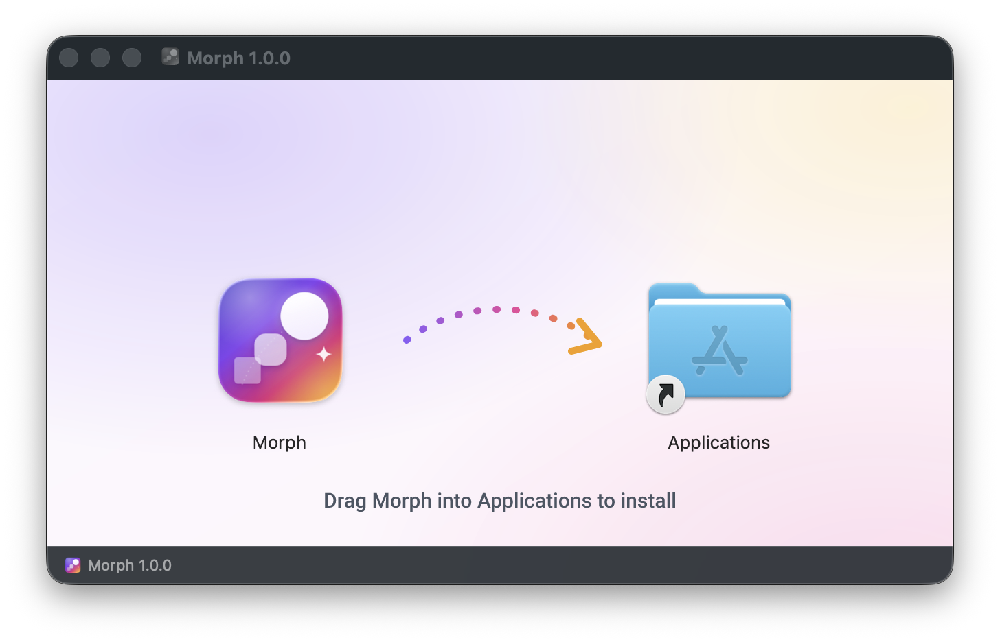

<p align="center">
  
</p>

<p align="center">
  <b>Convert and compress anything on your Mac — beautifully.</b><br>
  Images, video, audio and PDFs. Native, fast, and open source.
</p>

<p align="center">
  <a href="https://github.com/milescs/Morph/releases/latest"></a>
  <a href="LICENSE"></a>
  
</p>

<p align="center">
  
</p>

## Why Morph

- **Drop anything:** files, whole folders, or images from Photos. Morph shows every format each file can become.
- **See the size first:** the quality slider updates the estimated output size live, before you convert. For images the number is exact, because it comes from a real encode.
- **Saves where you expect:** the Finder panel opens in the original's folder, and originals are never overwritten.
- **Fast:** batches run in order, several at once when your Mac has room, on Apple's hardware video encoders. Morph slows down automatically when your Mac is hot or in Low Power Mode.
- **Menu bar:** drag files onto the Morph icon and drop them on a quick action, or grab a recent conversion and drag it straight into an upload form.

## Features

| | |
|---|---|
| **Images** | HEIC, JPEG, PNG, WebP, AVIF, TIFF, GIF, BMP, JPEG 2000, ICO, ICNS, PDF, and **SVG** (rendered, or traced from bitmaps). Reads JPEG XL, camera RAW, PSD and more. |
| **Video** | MP4, MOV, MKV and WebM, encoded with H.264, HEVC or ProRes on Apple hardware, or with x264, x265, SVT-AV1 or VP9. HDR is kept, or tone-mapped to SDR. |
| **Cross-format** | Video → GIF or animated WebP, GIF → MP4, a still frame from any video, and audio extracted from video. |
| **Audio** | MP3, AAC/M4A, Apple Lossless, WAV, AIFF, FLAC and Opus, with loudness normalization. |
| **PDF** | Pages → images, or combine any images into one PDF. |
| **Compress only** | Keep the format and just shrink it, or set a limit like **"≤ 2 MB"** for upload forms: Morph lowers quality, then resolution, until each file fits. |
| **Pro mode** | Container, encoder, rate control (quality, bitrate or target size), resolution, frame rate, keyframes, bit depth, HDR, audio codec, bitrate and channels, trim, rotate, metadata, and custom FFmpeg arguments. **Show command** gives you a copy-pasteable FFmpeg command line. |
| **Before / after** | A split-view preview of the converted image at 100%. |

## Screenshots

<table>
  <tr>
    <td></td>
    <td></td>
  </tr>
  <tr>
    <td align="center"><sub>Batches convert in order, in parallel</sub></td>
    <td align="center"><sub>Done: 52.6 MB saved</sub></td>
  </tr>
  <tr>
    <td></td>
    <td></td>
  </tr>
  <tr>
    <td align="center"><sub>Pro mode: every encoder option</sub></td>
    <td align="center"><sub>Compare before &amp; after</sub></td>
  </tr>
  <tr>
    <td></td>
    <td></td>
  </tr>
  <tr>
    <td align="center"><sub>Saves next to your originals by default</sub></td>
    <td align="center"><sub>Drop files or whole folders</sub></td>
  </tr>
</table>

<p align="center">
  
  &nbsp;&nbsp;
  
</p>

## Download

1. Download **Morph-1.0.0.dmg** from the [latest release](https://github.com/milescs/Morph/releases/latest).
2. Open it and drag **Morph** into **Applications**.
3. **First launch:** this build is signed but not yet notarized by Apple, so macOS will say it can't verify the developer.
   - Open **System Settings › Privacy & Security** and click **Open Anyway** next to Morph. You only need to do this once.
   - Or, in Terminal: `xattr -dr com.apple.quarantine /Applications/Morph.app`

Requires **macOS 26 Tahoe** or later on **Apple silicon**.

## Build from source

You need Xcode 26+, [Homebrew](https://brew.sh), `brew install xcodegen`, and Rust (`brew install rust`).

```sh
git clone https://github.com/milescs/Morph.git && cd Morph
make bootstrap   # Rust image codecs + Xcode project (also installs meson/autotools if missing)
make deps        # static FFmpeg 9 from source (~10–30 min, one time)
make run         # build and launch
```

Debug builds fall back to Homebrew's `ffmpeg` until `make deps` has finished.

| Command | What it does |
|---|---|
| `make test` | MorphKit unit + integration tests (`swift test`); test media is generated on the fly |
| `./scripts/release.sh` | Release build → styled DMG + FFmpeg source archive (notarizes when `DEVELOPER_ID`/`NOTARY_PROFILE` are set) |
| `./scripts/make-icons.sh` | Re-render the app icon, logo and DMG background from `Design/*.svg` (needs `cargo install resvg`) |

### Architecture

```
App/                SwiftUI views in AppKit-owned windows, menu bar item, settings
  State/            AppModel (files, settings, estimates), BatchRunner, presets
  MenuBar/          NSStatusItem + drop target + spring-loaded popover + animated icon
MorphKit/           Swift package: all conversion logic (no UI), fully tested
  Image/            ImageIO · libwebp · resvg · vtracer · oxipng + quantizr
  FFmpeg/           MediaPlanner → FFmpegCommandBuilder → FFmpegEngine (progress, cancel, 2-pass)
  Estimation/       size estimates and the encode cache
  Pipeline/         ConversionQueue (weighted parallelism), atomic output writing
Vendor/morph-rs/    Rust image codecs behind a small C ABI (→ MorphRust.xcframework)
Design/             SVG sources for the icon, logo, menu bar glyph and DMG background
scripts/            build-ffmpeg, build-rust, embed-ffmpeg (signing), release, make-icons
```

## License

Morph is released under the **[MIT License](LICENSE)**.

Downloads also bundle **FFmpeg** as separate `ffmpeg`/`ffprobe` executables, which are licensed under the **GPL-3.0**:
- the license text is inside the app, at *Morph › Settings › About › Show Licenses*
- the complete corresponding source is attached to every [release](https://github.com/milescs/Morph/releases)

See [THIRD_PARTY_NOTICES.md](THIRD_PARTY_NOTICES.md) for every open-source component Morph uses.
