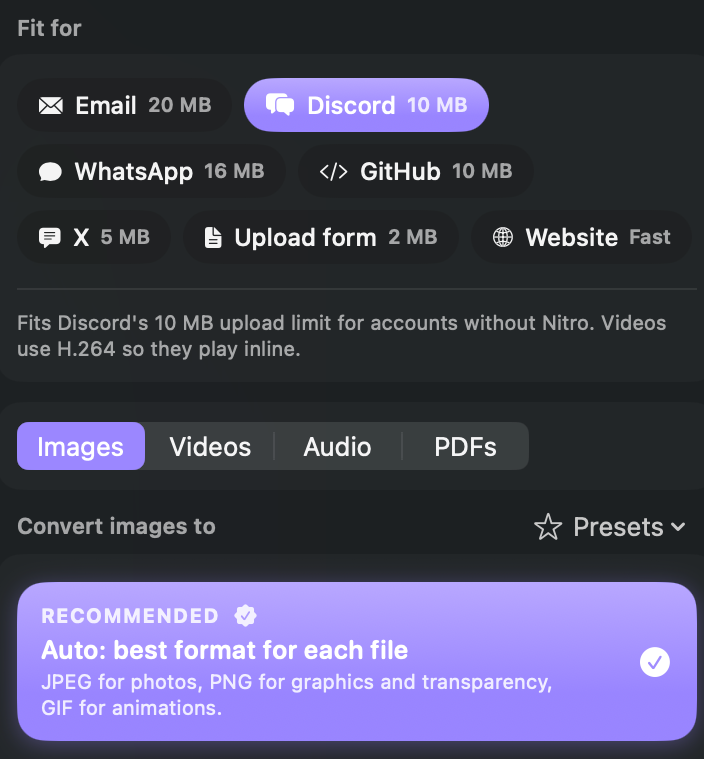
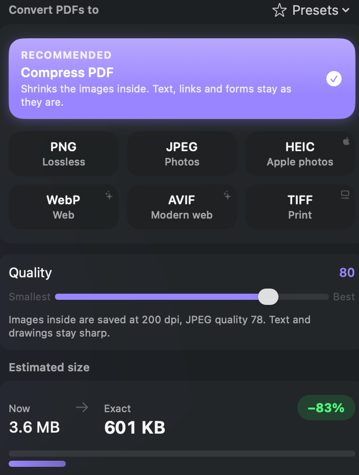
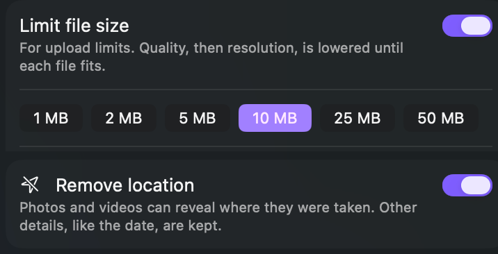
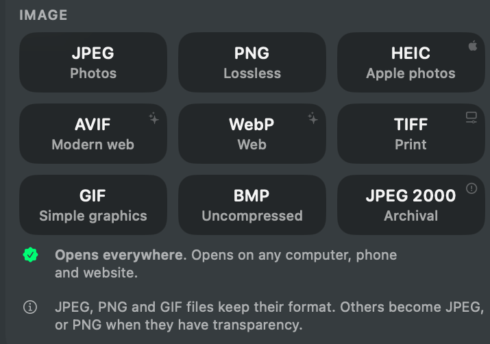
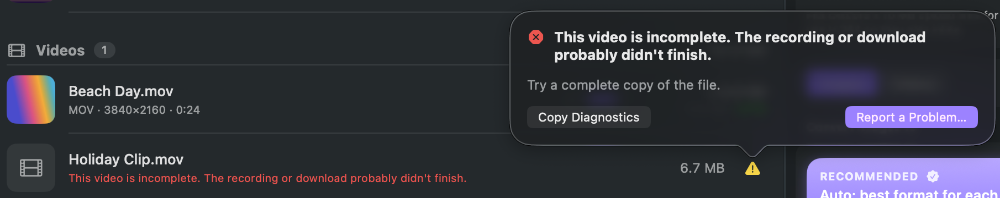
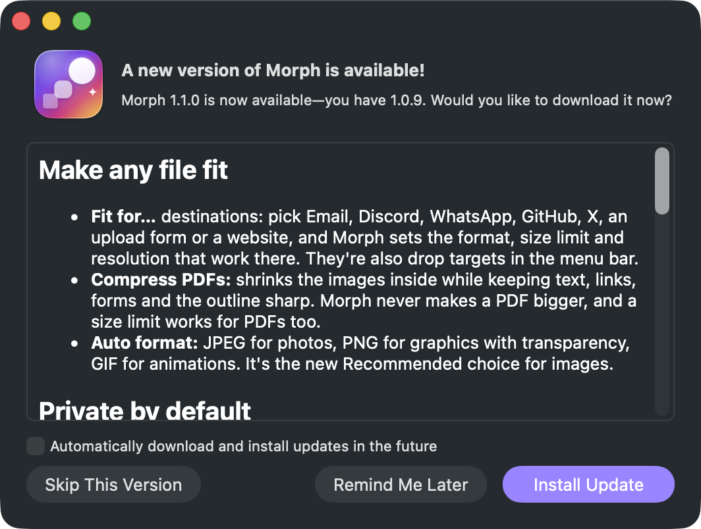
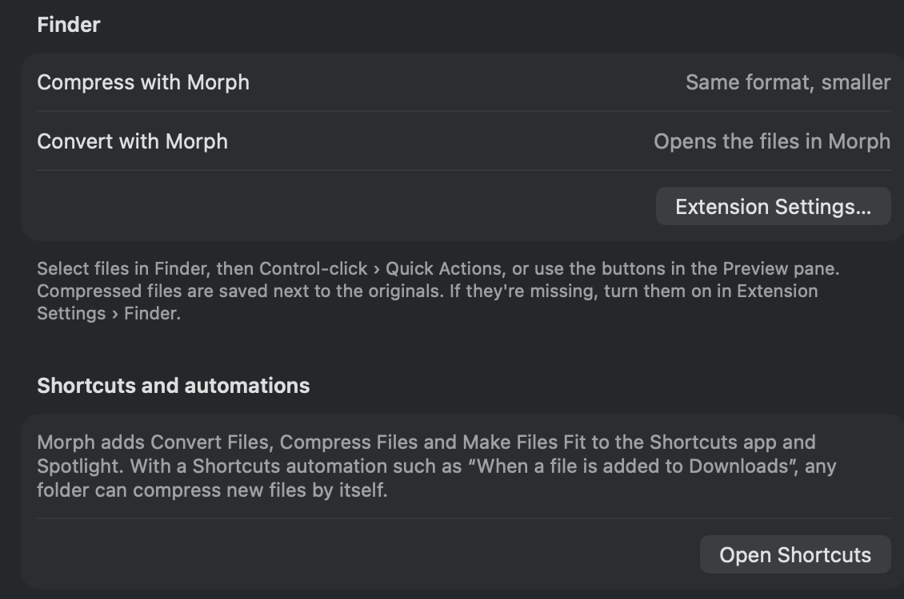
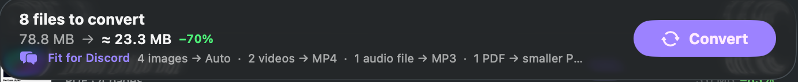
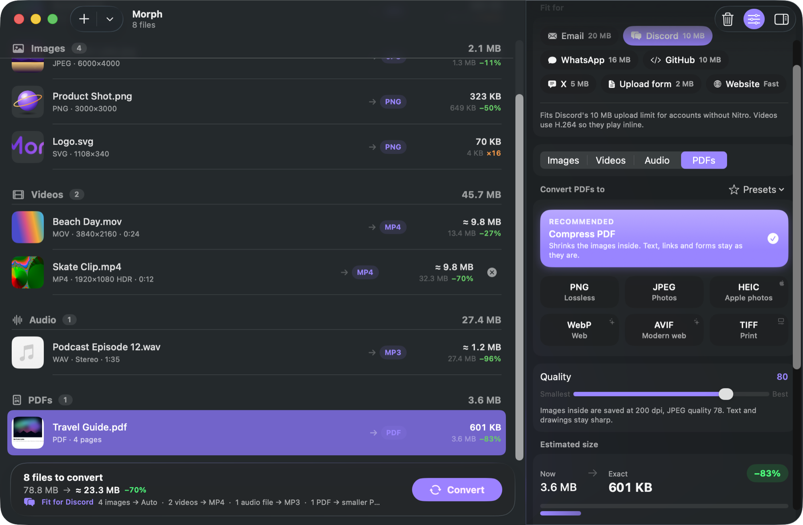

<p align="center">
  
</p>

<p align="center">
  <b>Make any file fit. Convert and compress anything on your Mac, privately.</b><br>
  Images, video, audio and PDFs. Native, fast, and open source.
</p>

<p align="center">
  <a href="https://github.com/milescs/Morph/releases/latest"></a>
  <a href="LICENSE"></a>
  
</p>

<p align="center">
  
</p>

## What's new in 1.1

<table>
  <tr>
    <td width="50%" valign="top">
      <br>
      <b>Fit for…</b> Pick where the files are going. Morph sets the format, size limit and resolution that work there, for photos, videos, audio and PDFs at once.
    </td>
    <td width="50%" valign="top">
      <br>
      <b>Compress PDFs.</b> The images inside are downsampled and re-compressed; text, links, forms and the outline stay as they are. This 3.6 MB guide became 601 KB.
    </td>
  </tr>
  <tr>
    <td valign="top">
      <br>
      <b>Private by default.</b> GPS location is removed from photos and videos unless you choose to keep it. Size limits work for every kind of file.
    </td>
    <td valign="top">
      <br>
      <b>Formats people can open.</b> Tiles are marked <i>Opens everywhere</i>, <i>Newer devices</i> or <i>Best on Apple devices</i>, and the new <b>Auto</b> format picks JPEG, PNG or GIF for each file.
    </td>
  </tr>
  <tr>
    <td valign="top">
      <br>
      <b>Problems, explained.</b> Errors say what went wrong and what to try. <b>Report a Problem…</b> pre-fills a GitHub issue without file names or paths.
    </td>
    <td valign="top">
      <br>
      <b>Notarized, and updates itself.</b> Signed with a Developer ID, notarized by Apple, and kept current with signed automatic updates.
    </td>
  </tr>
  <tr>
    <td valign="top">
      <br>
      <b>Finder, Shortcuts and Spotlight.</b> <i>Compress with Morph</i> from Finder's Quick Actions, and <i>Convert Files</i>, <i>Compress Files</i> and <i>Make Files Fit</i> in Shortcuts, Spotlight and folder automations.
    </td>
    <td valign="top">
      <br>
      <b>Drop on a destination.</b> The menu bar panel has a <i>Fit for</i> row: drag files onto Email, Discord or any other destination.
    </td>
  </tr>
</table>

<p align="center">
  <br>
  <sub>A summary above <b>Convert</b> shows exactly what will happen to each kind of file.</sub>
</p>

Tested against 80+ real-world files (408 conversions), from iPhone Dolby Vision video and ProRAW to scanned, password-protected and damaged files. See the [release notes](https://github.com/milescs/Morph/releases/tag/v1.1.0) for everything that changed.

## Why Morph

- **Make it fit:** pick where the files are going (Email, Discord, WhatsApp, GitHub, X, an upload form or a website) and Morph sets the format, size limit and resolution that work there. Or set any limit yourself, like **≤ 2 MB**: Morph lowers quality, then resolution, until each file fits.
- **See the size first:** the estimate updates live as you move the quality slider, before anything is converted. For images and PDFs the number is exact, because it comes from a real encode.
- **Private by default:** everything happens on your Mac and nothing is uploaded. Photos and videos lose their GPS location unless you choose to keep it.
- **Formats people can open:** every format is labeled by who can open it (*Opens everywhere*, *Newer devices*, *Best on Apple devices*), and one **Recommended** choice comes first. **Auto** picks JPEG for photos, PNG for graphics with transparency and GIF for animations.
- **Works where your files are:** drop files on the menu bar icon, use **Compress with Morph** in Finder, or add Morph's actions to Shortcuts and Spotlight. A Shortcuts automation turns any folder into a watch folder.
- **Fast:** batches run in order, several at once when your Mac has room, on Apple's hardware video encoders. Morph slows down automatically when your Mac is hot or in Low Power Mode.
- **Saves where you expect:** the Finder panel opens in the original's folder, and originals are never overwritten.

## Features

| | |
|---|---|
| **Fit for…** | One-tap destinations: Email (20 MB), Discord (10 MB), WhatsApp (16 MB), GitHub (10 MB), X (5 MB photos), upload forms (2 MB) and websites. The limits are refreshed from this repository, so they stay current without an app update. |
| **Images** | HEIC, JPEG, PNG, WebP, AVIF, TIFF, GIF, BMP, JPEG 2000, ICO, ICNS, PDF, and **SVG** (rendered, or traced from bitmaps). Reads JPEG XL, camera RAW, PSD and more. |
| **PDF** | **Compress PDFs:** the images inside are downsampled and re-compressed, while text, links, form fields and the outline are kept. Morph never makes a PDF bigger. Also: pages → images, and any images → one PDF. |
| **Video** | MP4, MOV, MKV and WebM, encoded with H.264, HEVC or ProRes on Apple hardware, or with x264, x265, SVT-AV1 or VP9. HDR is kept, or tone-mapped to SDR. |
| **Cross-format** | Video → GIF or animated WebP, GIF → MP4, a still frame from any video, and audio extracted from video. |
| **Audio** | MP3, AAC/M4A, Apple Lossless, WAV, AIFF, FLAC and Opus, with loudness normalization. |
| **Compress only** | Keep the format and just shrink it. |
| **Privacy** | Location is removed from photos and videos by default; other details, like the date, are kept. Pro mode can remove all metadata. |
| **Pro mode** | Container, encoder, rate control (quality, bitrate or target size), resolution, frame rate, keyframes, bit depth, HDR, audio codec, bitrate and channels, trim, rotate, metadata, and custom FFmpeg arguments. **Show command** gives you a copy-pasteable FFmpeg command line. |
| **Before / after** | A split-view preview of the converted image at 100%. |
| **Problems** | Errors are explained in plain language with what to try next. **Report a Problem…** opens a pre-filled GitHub issue that describes the file (format, codecs, size range) but never its name, location or contents. |

## Screenshots

<table>
  <tr>
    <td></td>
    <td></td>
  </tr>
  <tr>
    <td align="center"><sub>Batches convert in order, in parallel</sub></td>
    <td align="center"><sub>Everything fits: 63.5 MB saved</sub></td>
  </tr>
  <tr>
    <td></td>
    <td></td>
  </tr>
  <tr>
    <td align="center"><sub>PDFs: 3.6 MB → 601 KB</sub></td>
    <td align="center"><sub>Pro mode: every encoder option</sub></td>
  </tr>
  <tr>
    <td></td>
    <td></td>
  </tr>
  <tr>
    <td align="center"><sub>Compare before &amp; after</sub></td>
    <td align="center"><sub>Saves next to your originals by default</sub></td>
  </tr>
  <tr>
    <td></td>
    <td></td>
  </tr>
  <tr>
    <td align="center"><sub>Everything happens on your Mac</sub></td>
    <td align="center"><sub>Drag to Applications to install</sub></td>
  </tr>
</table>

## Download

1. Download **Morph-1.1.0.dmg** from the [latest release](https://github.com/milescs/Morph/releases/latest).
2. Open it and drag **Morph** into **Applications**.

Morph is signed with a Developer ID and notarized by Apple. It checks for updates once a day and can install them for you (Settings › General › Updates).

Requires **macOS 26 Tahoe** or later on **Apple silicon**.

## Use it from Finder, Shortcuts and Spotlight

- **Finder:** select files, then Control-click › **Quick Actions** › **Compress with Morph** (saves `name-compressed` next to each file) or **Convert with Morph** (opens them in Morph). The first time, choose **Quick Actions › Customize…** and turn both on. **Convert with Morph** is also in the Services menu.
- **Shortcuts and Spotlight:** Morph adds **Convert Files**, **Compress Files** and **Make Files Fit** (with a destination such as Email or Discord). Each returns the converted files, so you can chain them with other actions.
- **Watch folders:** in the Shortcuts app, create an automation for a folder (for example, your Screenshots or Downloads folder) and add Morph's **Compress Files** action. New files are compressed as they arrive.
- **Menu bar:** drag files onto the Morph icon and drop them on a quick action or a destination.

## Build from source

You need Xcode 26+, [Homebrew](https://brew.sh), `brew install xcodegen`, and Rust (`brew install rust`).

```sh
git clone https://github.com/milescs/Morph.git && cd Morph
make bootstrap   # Rust image codecs + Xcode project (also installs meson/autotools if missing)
make deps        # static FFmpeg 9 from source (~10–30 min, one time)
make run         # build and launch
```

Debug builds fall back to Homebrew's `ffmpeg` until `make deps` has finished.

| Command | What it does |
|---|---|
| `make test` | MorphKit unit + integration tests (`swift test`); test media is generated on the fly |
| `make corpus` | Real-world regression run: downloads 80+ public sample files (iPhone Dolby Vision, HDR10 and rotated or VFR video, ProRAW, HEIC grids, CMYK JPEGs, JPEG XL, scanned and password-protected PDFs, damaged files …) and converts each to its common formats |
| `./scripts/release.sh` | Release build → Developer ID signing and notarization → styled DMG, signed Sparkle `appcast.xml` and the FFmpeg source archive |
| `./scripts/make-icons.sh` | Re-render the app icon, logo and DMG background from `Design/*.svg` (needs `cargo install resvg`) |

Releases are signed for Sparkle with an EdDSA key kept in the release machine's keychain (created with Sparkle's `generate_keys`). Its public half is `SPARKLE_PUBLIC_KEY` in `project.yml`.

### Architecture

```
App/                SwiftUI views in AppKit-owned windows, menu bar item, settings
  State/            AppModel (files, settings, estimates), BatchRunner, presets, destinations
  Integrations/     Sparkle updater, App Intents (Shortcuts/Spotlight), Finder request handling
  MenuBar/          NSStatusItem + drop target + spring-loaded popover + animated icon
  Resources/        Destinations.json (upload limits, refreshed from GitHub)
Extensions/         Finder Quick Actions (sandboxed; hand the files to Morph)
MorphKit/           Swift package: all conversion logic (no UI), fully tested
  Image/            ImageIO · libwebp · resvg · vtracer · oxipng + quantizr
  PDF/              PDF compression (Quartz filters)
  FFmpeg/           MediaPlanner → FFmpegCommandBuilder → FFmpegEngine (progress, cancel, 2-pass)
  Estimation/       size estimates and the encode cache
  Pipeline/         ConversionQueue (weighted parallelism), atomic output writing
Corpus/             manifest of the real-world test files
Vendor/morph-rs/    Rust image codecs behind a small C ABI (→ MorphRust.xcframework)
Design/             SVG sources for the icon, logo, menu bar glyph and DMG background
scripts/            build-ffmpeg, build-rust, embed-ffmpeg (signing), release, corpus, make-icons
```

## License

Morph is released under the **[MIT License](LICENSE)**.

Downloads also bundle **FFmpeg** as separate `ffmpeg`/`ffprobe` executables, which are licensed under the **GPL-3.0**:
- the license text is inside the app, at *Morph › Settings › About › Show Licenses*
- the complete corresponding source is attached to every [release](https://github.com/milescs/Morph/releases)

See [THIRD_PARTY_NOTICES.md](THIRD_PARTY_NOTICES.md) for every open-source component Morph uses.
